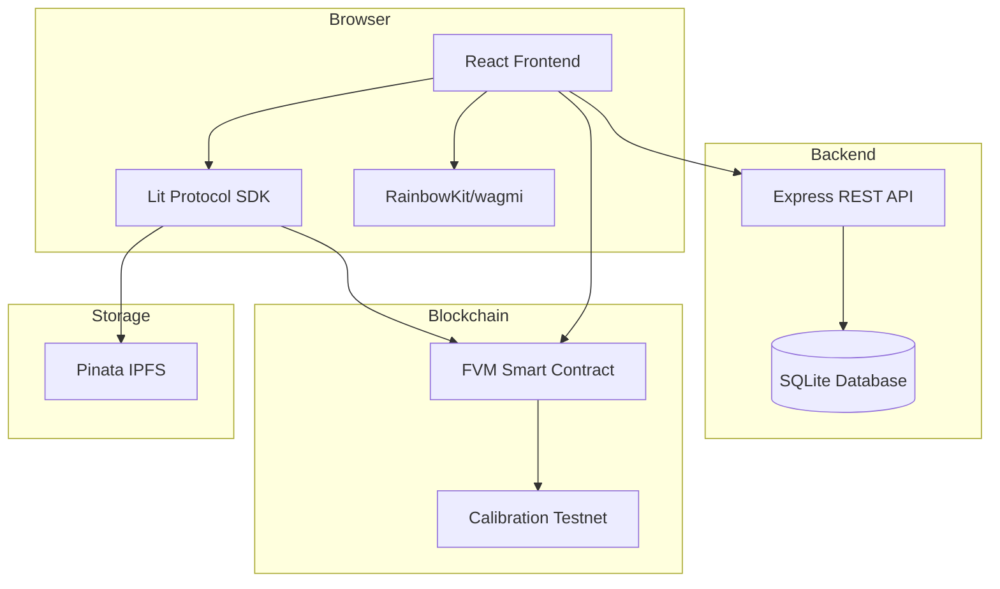
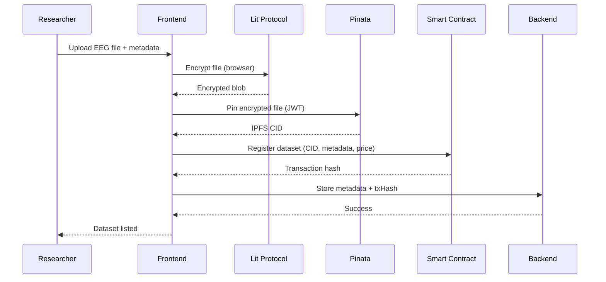
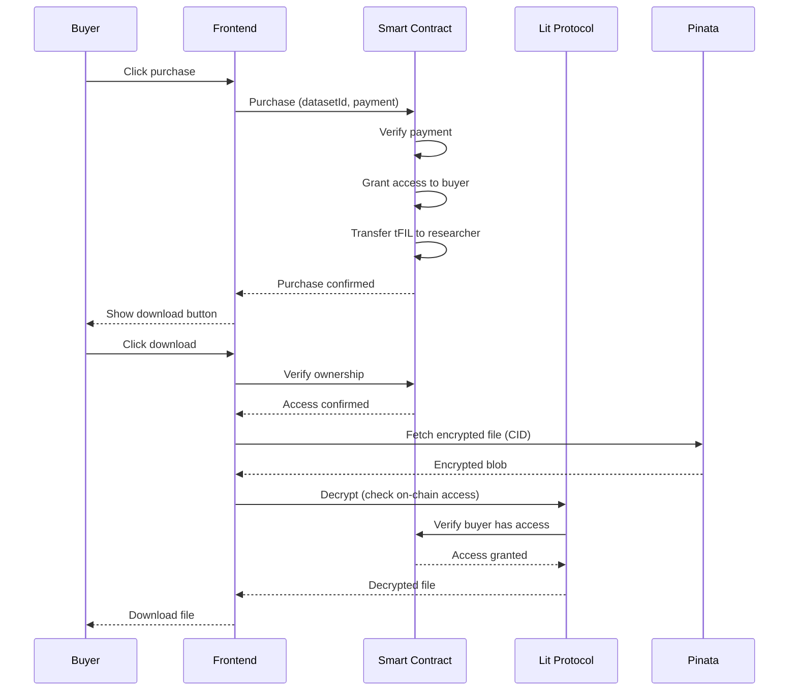

# Design Document: NeuroMarket

## Overview

NeuroMarket is a decentralized marketplace for EEG datasets built on the Filecoin FVM Calibration testnet. The architecture follows a three-tier model:

1. **Frontend (React + Vite + Tailwind)**: Browser-based UI handling wallet connection, file encryption, and user interactions
2. **Backend (Node.js + Express + SQLite)**: REST API for dataset metadata management and business logic
3. **Blockchain Layer (Solidity + FVM)**: Smart contracts for access control, payments, and ownership verification

The system uses client-side encryption (Lit Protocol) before upload, ensuring researchers maintain control over their data. Access control is enforced through on-chain ownership verification, with Lit Protocol acting as the decryption gatekeeper.

## Architecture

### System Components



### Data Flow: Upload Pipeline



### Data Flow: Purchase and Decrypt Pipeline



## Components and Interfaces

### Frontend Components

#### 1. Wallet Connection (RainbowKit + wagmi)

```typescript
interface WalletState {
  address: string | null;
  isConnected: boolean;
  chainId: number | null;
}

function useWalletConnection(): {
  connect: () => Promise<void>;
  disconnect: () => void;
  walletState: WalletState;
}
```

#### 2. Dataset Upload Form

```typescript
interface UploadFormData {
  title: string;
  description: string;
  price: string; // in tFIL
  file: File;
}

interface UploadResult {
  cid: string;
  txHash: string;
  datasetId: string;
}

async function uploadDataset(
  formData: UploadFormData,
  walletAddress: string
): Promise<UploadResult>
```

**Upload Process:**
1. Validate form inputs (title, description, price, file)
2. Encrypt file using Lit Protocol in browser
3. Pin encrypted blob to Pinata via JWT
4. Call smart contract to register dataset
5. Store metadata in backend database
6. Return CID and transaction hash

#### 3. Marketplace Listing

```typescript
interface Dataset {
  id: string;
  title: string;
  description: string;
  price: string;
  cid: string;
  researcherAddress: string;
  uploadDate: string;
  purchaseCount: number;
}

async function fetchDatasets(): Promise<Dataset[]>
```

#### 4. Dataset Detail and Purchase

```typescript
interface PurchaseResult {
  txHash: string;
  success: boolean;
}

async function purchaseDataset(
  datasetId: string,
  price: string,
  buyerAddress: string
): Promise<PurchaseResult>
```

#### 5. Decrypt and Download

```typescript
async function decryptAndDownload(
  cid: string,
  datasetId: string,
  buyerAddress: string
): Promise<void>
```

**Decrypt Process:**
1. Verify on-chain ownership via smart contract
2. Fetch encrypted file from IPFS using CID
3. Call Lit Protocol decryptToFile with access conditions
4. Lit Protocol verifies on-chain access
5. Trigger browser download of decrypted file

#### 6. Researcher Dashboard

```typescript
interface ResearcherDataset extends Dataset {
  earnings: string;
  buyers: string[];
}

async function fetchResearcherDatasets(
  researcherAddress: string
): Promise<ResearcherDataset[]>
```

### Backend API Endpoints

```typescript
// Dataset metadata management
POST   /api/datasets              // Store dataset metadata
GET    /api/datasets              // List all datasets
GET    /api/datasets/:id          // Get dataset details
GET    /api/datasets/researcher/:address  // Get researcher's datasets

// Health check
GET    /api/health
```

#### Dataset Schema (SQLite)

```sql
CREATE TABLE datasets (
  id TEXT PRIMARY KEY,
  title TEXT NOT NULL,
  description TEXT NOT NULL,
  price TEXT NOT NULL,
  cid TEXT NOT NULL,
  researcher_address TEXT NOT NULL,
  tx_hash TEXT NOT NULL,
  upload_date TEXT NOT NULL,
  purchase_count INTEGER DEFAULT 0
);

CREATE TABLE purchases (
  id INTEGER PRIMARY KEY AUTOINCREMENT,
  dataset_id TEXT NOT NULL,
  buyer_address TEXT NOT NULL,
  tx_hash TEXT NOT NULL,
  purchase_date TEXT NOT NULL,
  FOREIGN KEY (dataset_id) REFERENCES datasets(id)
);
```

### Smart Contract Interface

```solidity
// SPDX-License-Identifier: MIT
pragma solidity ^0.8.0;

contract NeuroMarketplace {
    struct Dataset {
        string cid;
        address researcher;
        uint256 price;
        bool exists;
    }
    
    // datasetId => Dataset
    mapping(string => Dataset) public datasets;
    
    // datasetId => buyer => hasAccess
    mapping(string => mapping(address => bool)) public accessControl;
    
    event DatasetRegistered(
        string indexed datasetId,
        string cid,
        address indexed researcher,
        uint256 price
    );
    
    event DatasetPurchased(
        string indexed datasetId,
        address indexed buyer,
        address indexed researcher,
        uint256 price
    );
    
    // Register a new dataset
    function registerDataset(
        string memory datasetId,
        string memory cid,
        uint256 price
    ) external;
    
    // Purchase access to a dataset
    function purchaseDataset(string memory datasetId) external payable;
    
    // Check if an address has access to a dataset
    function hasAccess(
        string memory datasetId,
        address buyer
    ) external view returns (bool);
    
    // Get dataset information
    function getDataset(string memory datasetId) 
        external 
        view 
        returns (string memory cid, address researcher, uint256 price);
}
```

**Security Implementation (Checks-Effects-Interactions):**

```solidity
function purchaseDataset(string memory datasetId) external payable {
    // CHECKS
    Dataset storage dataset = datasets[datasetId];
    require(dataset.exists, "Dataset does not exist");
    require(msg.value == dataset.price, "Incorrect payment amount");
    require(!accessControl[datasetId][msg.sender], "Already purchased");
    
    // EFFECTS
    accessControl[datasetId][msg.sender] = true;
    
    // INTERACTIONS
    (bool success, ) = dataset.researcher.call{value: msg.value}("");
    require(success, "Payment transfer failed");
    
    emit DatasetPurchased(datasetId, msg.sender, dataset.researcher, msg.value);
}
```

### Lit Protocol Integration

#### Encryption Configuration

```typescript
interface LitEncryptionConfig {
  network: 'datil-dev'; // Free tier
  accessControlConditions: AccessControlCondition[];
}

interface AccessControlCondition {
  contractAddress: string; // Smart contract address
  functionName: 'hasAccess';
  functionParams: [':datasetId', ':userAddress'];
  functionAbi: any;
  chain: 'filecoin';
  returnValueTest: {
    comparator: '=';
    value: 'true';
  };
}
```

#### Encryption Flow

```typescript
async function encryptFile(file: File, datasetId: string): Promise<{
  encryptedFile: Blob;
  encryptedSymmetricKey: string;
}> {
  const litClient = new LitNodeClient({
    litNetwork: 'datil-dev'
  });
  
  await litClient.connect();
  
  const accessControlConditions = [{
    contractAddress: SMART_CONTRACT_ADDRESS,
    functionName: 'hasAccess',
    functionParams: [datasetId, ':userAddress'],
    functionAbi: HAS_ACCESS_ABI,
    chain: 'filecoin',
    returnValueTest: {
      comparator: '=',
      value: 'true'
    }
  }];
  
  const { encryptedFile, symmetricKey } = await LitJsSdk.encryptFile({
    file,
    accessControlConditions,
    chain: 'filecoin'
  });
  
  return {
    encryptedFile,
    encryptedSymmetricKey: symmetricKey
  };
}
```

#### Decryption Flow

```typescript
async function decryptFile(
  encryptedFile: Blob,
  encryptedSymmetricKey: string,
  datasetId: string,
  buyerAddress: string
): Promise<File> {
  const litClient = new LitNodeClient({
    litNetwork: 'datil-dev'
  });
  
  await litClient.connect();
  
  const accessControlConditions = [{
    contractAddress: SMART_CONTRACT_ADDRESS,
    functionName: 'hasAccess',
    functionParams: [datasetId, buyerAddress],
    functionAbi: HAS_ACCESS_ABI,
    chain: 'filecoin',
    returnValueTest: {
      comparator: '=',
      value: 'true'
    }
  }];
  
  // Lit Protocol will verify on-chain access before decrypting
  const decryptedFile = await LitJsSdk.decryptToFile({
    file: encryptedFile,
    symmetricKey: encryptedSymmetricKey,
    accessControlConditions,
    chain: 'filecoin',
    authSig: await getAuthSig(buyerAddress)
  });
  
  return decryptedFile;
}
```

### Pinata Integration

```typescript
interface PinataConfig {
  jwt: string; // JWT token from Pinata dashboard
  gateway: string; // IPFS gateway URL
}

async function pinFileToPinata(
  encryptedFile: Blob,
  metadata: { name: string; keyvalues: Record<string, string> }
): Promise<string> {
  const formData = new FormData();
  formData.append('file', encryptedFile);
  formData.append('pinataMetadata', JSON.stringify(metadata));
  
  const response = await fetch('https://api.pinata.cloud/pinning/pinFileToIPFS', {
    method: 'POST',
    headers: {
      'Authorization': `Bearer ${PINATA_JWT}`
    },
    body: formData
  });
  
  const result = await response.json();
  return result.IpfsHash; // CID
}

async function fetchFromIPFS(cid: string): Promise<Blob> {
  const response = await fetch(`${PINATA_GATEWAY}/ipfs/${cid}`);
  return await response.blob();
}
```

## Data Models

### Frontend State Management

```typescript
// Global app state
interface AppState {
  wallet: WalletState;
  datasets: Dataset[];
  loading: boolean;
  error: string | null;
}

// Upload form state
interface UploadState {
  formData: UploadFormData;
  uploading: boolean;
  progress: {
    encrypting: boolean;
    pinning: boolean;
    registering: boolean;
  };
  error: string | null;
}

// Purchase state
interface PurchaseState {
  purchasing: boolean;
  txHash: string | null;
  error: string | null;
}
```

### Backend Models

```typescript
interface DatasetModel {
  id: string;
  title: string;
  description: string;
  price: string;
  cid: string;
  researcherAddress: string;
  txHash: string;
  uploadDate: string;
  purchaseCount: number;
}

interface PurchaseModel {
  id: number;
  datasetId: string;
  buyerAddress: string;
  txHash: string;
  purchaseDate: string;
}
```

### Smart Contract Storage

```solidity
struct Dataset {
    string cid;              // IPFS content identifier
    address researcher;      // Dataset owner
    uint256 price;          // Price in wei (tFIL)
    bool exists;            // Registration flag
}

// Mappings
mapping(string => Dataset) public datasets;
mapping(string => mapping(address => bool)) public accessControl;
```


## Correctness Properties

*A property is a characteristic or behavior that should hold true across all valid executions of a system—essentially, a formal statement about what the system should do. Properties serve as the bridge between human-readable specifications and machine-verifiable correctness guarantees.*

### Wallet and Authentication Properties

**Property 1: Wallet state persistence**
*For any* connected wallet and any navigation action (page change, refresh, or interaction), the wallet connection state and address should remain consistent and accessible throughout the session.
**Validates: Requirements 1.2, 1.4, 9.3**

**Property 2: Wallet disconnection cleanup**
*For any* wallet disconnection action, all wallet-related state (address, connection status, session data) should be completely cleared from the application.
**Validates: Requirements 1.5**

**Property 3: Connection error handling**
*For any* wallet connection failure, the system should display an error message and provide a retry mechanism without losing user context.
**Validates: Requirements 1.3**

### Upload Pipeline Properties

**Property 4: File validation before processing**
*For any* file upload attempt, the system should validate file format and size before proceeding with encryption, rejecting invalid files immediately.
**Validates: Requirements 2.1**

**Property 5: Upload pipeline integrity**
*For any* valid file upload, the complete pipeline (encrypt → pin → register → store) should execute in sequence, and if any step fails, subsequent steps should not execute.
**Validates: Requirements 2.2, 2.3, 3.1**

**Property 6: CID generation and storage**
*For any* successfully pinned encrypted file, the system should receive a valid IPFS CID and store it both in the smart contract and backend database.
**Validates: Requirements 2.4, 3.3, 12.3**

**Property 7: Upload completion state**
*For any* successful upload completion, the form should be cleared, success confirmation displayed, and the dataset should become visible in the marketplace.
**Validates: Requirements 2.6, 3.5**

**Property 8: Metadata completeness**
*For any* dataset registration transaction, all required metadata fields (title, description, price, researcher address, CID) should be included and non-empty.
**Validates: Requirements 3.2**

### Marketplace and Display Properties

**Property 9: Marketplace listing completeness**
*For any* marketplace page load, all registered datasets should be displayed with complete information (title, description, price, researcher address).
**Validates: Requirements 4.1, 4.2**

**Property 10: Dataset navigation**
*For any* dataset click in the marketplace, the system should navigate to the corresponding detail page without full page reload while maintaining application state.
**Validates: Requirements 4.3, 9.2**

**Property 11: Researcher dataset filtering**
*For any* researcher wallet address, the dashboard should display only datasets where the researcher address matches the wallet address, with complete metadata.
**Validates: Requirements 7.1, 7.2, 10.4**

### Purchase and Payment Properties

**Property 12: Purchase precondition verification**
*For any* purchase attempt, the system should verify wallet connection and sufficient balance before initiating the transaction.
**Validates: Requirements 5.1**

**Property 13: Purchase transaction completeness**
*For any* purchase transaction, the system should include both dataset ID and exact payment amount, and the smart contract should verify payment matches dataset price before processing.
**Validates: Requirements 5.2, 8.3**

**Property 14: Purchase atomicity (Checks-Effects-Interactions)**
*For any* successful purchase transaction, the smart contract should: (1) verify payment amount, (2) grant access to buyer, (3) transfer funds to researcher, in that exact order, and emit a purchase event.
**Validates: Requirements 5.3, 5.4, 8.4, 8.6**

**Property 15: Purchase UI state update**
*For any* completed purchase, the UI should immediately reflect ownership status, enabling download functionality for the buyer.
**Validates: Requirements 5.6**

### Access Control and Decryption Properties

**Property 16: Encryption round-trip with access control**
*For any* valid dataset file, encrypting with Lit Protocol then decrypting (with proper on-chain access) should produce an equivalent file to the original.
**Validates: Requirements 2.2, 6.3, 11.2, 11.3**

**Property 17: On-chain access verification**
*For any* decryption attempt, Lit Protocol should query the smart contract's hasAccess function with the dataset ID and buyer address, and only proceed if the function returns true.
**Validates: Requirements 6.1, 6.4, 11.4**

**Property 18: Access denial for non-owners**
*For any* wallet address that has not purchased a dataset, decryption attempts should be rejected by Lit Protocol with an access denied error.
**Validates: Requirements 6.5**

**Property 19: Download trigger after decryption**
*For any* successful decryption operation, the system should trigger a browser download of the decrypted file with the original filename.
**Validates: Requirements 6.6**

**Property 20: IPFS retrieval by CID**
*For any* valid IPFS CID stored in the system, fetching from the Pinata gateway should return the encrypted file blob.
**Validates: Requirements 6.2, 12.4**

### Smart Contract Security Properties

**Property 21: Input validation before execution**
*For any* smart contract function call with invalid parameters (empty strings, zero addresses, incorrect values), the function should revert before making any state changes.
**Validates: Requirements 8.5**

**Property 22: Event emission for state changes**
*For any* state-changing operation (dataset registration, purchase, access grant), the smart contract should emit a corresponding event with all relevant parameters.
**Validates: Requirements 8.6**

**Property 23: Idempotent purchase prevention**
*For any* buyer who has already purchased a dataset, subsequent purchase attempts for the same dataset should be rejected by the smart contract.
**Validates: Requirements 5.3**

### Backend API Properties

**Property 24: API data persistence**
*For any* dataset registration request to the backend, the metadata should be stored in SQLite and retrievable via the GET endpoints.
**Validates: Requirements 10.1, 10.2, 10.3**

**Property 25: API input validation**
*For any* API request with invalid or malformed data, the backend should return a 400-level error response without processing the request.
**Validates: Requirements 10.5**

### Integration Properties

**Property 26: Pinata JWT authentication**
*For any* file pinning operation, the system should include valid JWT authentication in the request headers to Pinata API.
**Validates: Requirements 12.2**

**Property 27: Lit Protocol access condition configuration**
*For any* encryption or decryption operation, the access control conditions should reference the deployed smart contract address and hasAccess function.
**Validates: Requirements 11.4**

### Error Handling Properties

**Property 28: Pipeline error recovery**
*For any* failure in the upload pipeline (encryption, pinning, or registration), the system should display a specific error message, maintain form state, and allow the user to retry from the failed step.
**Validates: Requirements 2.5, 3.4, 11.6, 12.6**

**Property 29: Transaction error reporting**
*For any* failed blockchain transaction (purchase or registration), the system should display the error reason from the smart contract and maintain application state.
**Validates: Requirements 5.5**

**Property 30: Decryption error handling**
*For any* decryption failure (access denied, network error, or invalid file), the system should display a user-friendly error message without crashing.
**Validates: Requirements 6.7**

**Property 31: Backend error responses**
*For any* database operation failure in the backend, the API should return an appropriate HTTP error status (500) with an error message.
**Validates: Requirements 10.6**

## Error Handling

### Frontend Error Handling

**Upload Pipeline Errors:**
- File validation errors: Display inline validation messages
- Encryption errors: Show Lit Protocol error with retry option
- Pinata errors: Show IPFS upload error with retry option
- Smart contract errors: Show transaction error with retry option
- Network errors: Show connectivity error with retry option

**Purchase Flow Errors:**
- Wallet not connected: Prompt to connect wallet
- Insufficient balance: Display balance error
- Transaction rejection: Show user rejected transaction
- Contract revert: Display revert reason from contract
- Network errors: Show connectivity error with retry option

**Decryption Errors:**
- Access denied: Display "You don't own this dataset"
- Lit Protocol errors: Show decryption error with support link
- IPFS fetch errors: Show file retrieval error with retry
- Network errors: Show connectivity error with retry option

### Backend Error Handling

**API Error Responses:**
```typescript
interface ErrorResponse {
  error: string;
  message: string;
  statusCode: number;
}

// 400 - Bad Request (invalid input)
// 404 - Not Found (dataset doesn't exist)
// 500 - Internal Server Error (database or system error)
```

**Database Error Handling:**
- Connection errors: Retry with exponential backoff
- Query errors: Log error and return 500 response
- Constraint violations: Return 400 with specific message

### Smart Contract Error Handling

**Revert Conditions:**
```solidity
require(dataset.exists, "Dataset does not exist");
require(msg.value == dataset.price, "Incorrect payment amount");
require(!accessControl[datasetId][msg.sender], "Already purchased");
require(bytes(cid).length > 0, "CID cannot be empty");
require(price > 0, "Price must be greater than zero");
```

**Event Logging:**
All errors should be traceable through event emissions and transaction logs.

## Testing Strategy

### Dual Testing Approach

The testing strategy employs both unit tests and property-based tests to ensure comprehensive coverage:

**Unit Tests** focus on:
- Specific examples of correct behavior
- Edge cases (empty states, boundary conditions)
- Error conditions and failure modes
- Integration points between components
- UI component rendering and interactions

**Property-Based Tests** focus on:
- Universal properties that hold for all inputs
- Comprehensive input coverage through randomization
- Invariants that must be maintained
- Round-trip properties (encrypt/decrypt, serialize/deserialize)
- Access control rules across all scenarios

### Property-Based Testing Configuration

**Library Selection:**
- **Frontend (TypeScript)**: fast-check
- **Smart Contracts (Solidity)**: Foundry's property testing with Echidna
- **Backend (Node.js)**: fast-check

**Test Configuration:**
- Minimum 100 iterations per property test
- Each test tagged with: `Feature: neuromarket, Property {N}: {property description}`
- Each correctness property implemented as a single property-based test

### Frontend Testing

**Unit Tests (Vitest + React Testing Library):**
```typescript
// Example: Wallet connection button
test('clicking connect wallet opens RainbowKit modal', async () => {
  render(<WalletConnect />);
  const button = screen.getByText('Connect Wallet');
  await userEvent.click(button);
  expect(screen.getByRole('dialog')).toBeInTheDocument();
});

// Example: Empty marketplace state
test('displays empty message when no datasets', () => {
  render(<Marketplace datasets={[]} />);
  expect(screen.getByText(/no datasets available/i)).toBeInTheDocument();
});
```

**Property-Based Tests (fast-check):**
```typescript
// Feature: neuromarket, Property 8: Metadata completeness
test('all dataset registrations include complete metadata', () => {
  fc.assert(
    fc.property(
      fc.record({
        title: fc.string({ minLength: 1 }),
        description: fc.string({ minLength: 1 }),
        price: fc.double({ min: 0.01 }),
        file: fc.constant(new File(['data'], 'test.eeg'))
      }),
      async (formData) => {
        const result = await uploadDataset(formData, MOCK_ADDRESS);
        const registered = await getDatasetFromContract(result.datasetId);
        
        expect(registered.cid).toBeTruthy();
        expect(registered.researcher).toBe(MOCK_ADDRESS);
        expect(registered.price).toBeGreaterThan(0);
      }
    ),
    { numRuns: 100 }
  );
});

// Feature: neuromarket, Property 16: Encryption round-trip
test('encrypt then decrypt produces equivalent file', () => {
  fc.assert(
    fc.property(
      fc.uint8Array({ minLength: 100, maxLength: 10000 }),
      async (fileData) => {
        const originalFile = new File([fileData], 'test.eeg');
        const datasetId = generateDatasetId();
        
        // Encrypt
        const { encryptedFile, encryptedSymmetricKey } = 
          await encryptFile(originalFile, datasetId);
        
        // Grant access on-chain (mock)
        await grantAccess(datasetId, BUYER_ADDRESS);
        
        // Decrypt
        const decryptedFile = await decryptFile(
          encryptedFile,
          encryptedSymmetricKey,
          datasetId,
          BUYER_ADDRESS
        );
        
        const decryptedData = await decryptedFile.arrayBuffer();
        expect(new Uint8Array(decryptedData)).toEqual(fileData);
      }
    ),
    { numRuns: 100 }
  );
});
```

### Smart Contract Testing

**Unit Tests (Foundry):**
```solidity
// Example: Purchase with incorrect payment
function testPurchaseWithIncorrectPayment() public {
    string memory datasetId = "dataset1";
    marketplace.registerDataset(datasetId, "QmTest", 1 ether);
    
    vm.expectRevert("Incorrect payment amount");
    marketplace.purchaseDataset{value: 0.5 ether}(datasetId);
}

// Example: Duplicate purchase prevention
function testCannotPurchaseTwice() public {
    string memory datasetId = "dataset1";
    marketplace.registerDataset(datasetId, "QmTest", 1 ether);
    
    marketplace.purchaseDataset{value: 1 ether}(datasetId);
    
    vm.expectRevert("Already purchased");
    marketplace.purchaseDataset{value: 1 ether}(datasetId);
}
```

**Property-Based Tests (Echidna):**
```solidity
// Feature: neuromarket, Property 14: Purchase atomicity
function echidna_purchase_grants_access() public returns (bool) {
    // After any purchase, buyer must have access
    string memory datasetId = "test";
    if (datasets[datasetId].exists && accessControl[datasetId][msg.sender]) {
        return hasAccess(datasetId, msg.sender);
    }
    return true;
}

// Feature: neuromarket, Property 21: Input validation
function echidna_no_empty_cid() public returns (bool) {
    // No dataset should ever have an empty CID
    string memory datasetId = "test";
    if (datasets[datasetId].exists) {
        return bytes(datasets[datasetId].cid).length > 0;
    }
    return true;
}

// Feature: neuromarket, Property 23: Idempotent purchase prevention
function echidna_single_purchase_per_buyer() public returns (bool) {
    // A buyer can only purchase a dataset once
    string memory datasetId = "test";
    if (accessControl[datasetId][msg.sender]) {
        // If we have access, trying to purchase again should fail
        try this.purchaseDataset{value: datasets[datasetId].price}(datasetId) {
            return false; // Should have reverted
        } catch {
            return true; // Correctly prevented duplicate purchase
        }
    }
    return true;
}
```

### Backend Testing

**Unit Tests (Jest):**
```typescript
// Example: API input validation
test('POST /api/datasets rejects invalid data', async () => {
  const response = await request(app)
    .post('/api/datasets')
    .send({ title: '', price: -1 }); // Invalid
  
  expect(response.status).toBe(400);
  expect(response.body.error).toBeTruthy();
});

// Example: Researcher filtering
test('GET /api/datasets/researcher/:address returns only researcher datasets', async () => {
  await createDataset({ researcherAddress: 'address1' });
  await createDataset({ researcherAddress: 'address2' });
  
  const response = await request(app)
    .get('/api/datasets/researcher/address1');
  
  expect(response.body.length).toBe(1);
  expect(response.body[0].researcherAddress).toBe('address1');
});
```

**Property-Based Tests (fast-check):**
```typescript
// Feature: neuromarket, Property 24: API data persistence
test('stored datasets are retrievable', () => {
  fc.assert(
    fc.property(
      fc.record({
        id: fc.uuid(),
        title: fc.string({ minLength: 1 }),
        description: fc.string({ minLength: 1 }),
        price: fc.double({ min: 0.01 }).map(String),
        cid: fc.string({ minLength: 10 }),
        researcherAddress: fc.hexaString({ minLength: 40, maxLength: 40 })
      }),
      async (dataset) => {
        // Store
        await request(app)
          .post('/api/datasets')
          .send(dataset);
        
        // Retrieve
        const response = await request(app)
          .get(`/api/datasets/${dataset.id}`);
        
        expect(response.status).toBe(200);
        expect(response.body.id).toBe(dataset.id);
        expect(response.body.title).toBe(dataset.title);
        expect(response.body.cid).toBe(dataset.cid);
      }
    ),
    { numRuns: 100 }
  );
});

// Feature: neuromarket, Property 25: API input validation
test('API rejects all invalid inputs', () => {
  fc.assert(
    fc.property(
      fc.record({
        title: fc.option(fc.string(), { nil: undefined }),
        price: fc.option(fc.double({ max: 0 }), { nil: undefined }),
        cid: fc.option(fc.constant(''), { nil: undefined })
      }),
      async (invalidData) => {
        const response = await request(app)
          .post('/api/datasets')
          .send(invalidData);
        
        expect(response.status).toBeGreaterThanOrEqual(400);
        expect(response.status).toBeLessThan(500);
      }
    ),
    { numRuns: 100 }
  );
});
```

### Integration Testing

**End-to-End Flow Tests:**
1. Complete upload flow (encrypt → pin → register → verify)
2. Complete purchase flow (connect → buy → verify access)
3. Complete download flow (verify → fetch → decrypt → download)
4. Researcher dashboard flow (upload → view → verify stats)

**Mock Services:**
- Mock Lit Protocol for deterministic encryption/decryption
- Mock Pinata API for IPFS operations
- Mock RainbowKit for wallet connections
- Local testnet for smart contract interactions

### Test Coverage Goals

- **Frontend**: 80% code coverage, 100% property coverage
- **Smart Contracts**: 100% code coverage, 100% property coverage
- **Backend**: 80% code coverage, 100% property coverage
- **Integration**: All critical user flows covered

### Continuous Testing

- Run unit tests on every commit
- Run property tests on every pull request
- Run integration tests before deployment
- Monitor test execution time (property tests may be slower)
